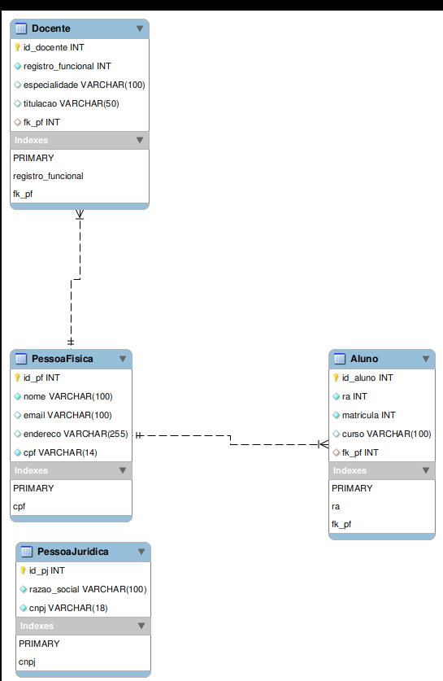

# Projeto_Integrador_SENAC

Realização do PI para o curso de ADS do SENAC 

Link do protótipo realizado utilizando o figma: 

https://www.figma.com/make/kH2tJUa0J9kLGPXYShEayN/Criar-prot%C3%B3tipo-baseado-na-UML?t=cj95oEBcFRpZEDgV-1

https://words-blast-34590257.figma.site/ 

O script_banco.sql representa o banco de dados gerado contemplando o modelo UML descrito no PI passado.

